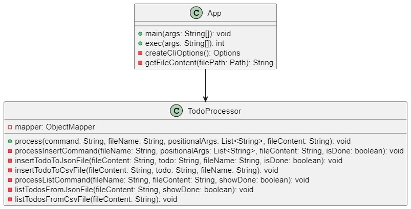

# L3 design pattern report

- **Firstname**: [Francesco]
- **Lastname**: [Abou Nader]

> Add your thoughts on every TP bellow, everything is interresting but no need to right a book.
> 
> Keep it short simple and efficient:
> 
> - What you did and why
> - 
> - La refonte vise à obtenir un code plus propre et modulaire tout en respectant les principes SOLID:
> - 1) J'ai créé des méthodes pour des tâches spécifiques telles que le "command processing, file content retrieval, and option creation", afin de respecter le "Single Responsibility Principle".
> - 2) J'ai introduit des méthodes pour "inserting and listing TODOs" pour les fichiers JSON et CSV séparément afin d'améliorer la modularité du code.
> - 3) J'ai encapsulé la logique de récupération du contenu du fichier pour améliorer la réutilisation du code et la facilité de maintenance.
> - 4) J'ai maintenu une utilisation cohérente des chemins et supprimé les commentaires inutiles pour plus de clarté.
> - 5) J'ai regroupé des fonctionnalités similaires pour éliminer la duplication de code.
> 
> - 4/2/2024
> - pour afficher les todos qui sont done ou pas:
> - 1) Ajout de l'option "--done" à l'objet "Options" en utilisant cliOptions.addOption("d", "done", false, "Marquer la tâche comme terminée");.
> - 2) Modification de "processInsertCommand" pour accepter un paramètre boolean "isDone", indiquant si la tâche est terminée.
       Dans "insertTodoToJsonFile", création d'un "ObjectNode" pour chaque tâche, comprenant les propriétés "name" et "done". La propriété "done" est définie en fonction du paramètre "isDone".
> - 3) Mise à jour de "processListCommand" pour accepter un paramètre boolean "showDone".
       Dans listTodosFromJsonFile, ajout d'une logique pour vérifier la propriété "done" de chaque tâche et afficher "Done: " avant la tâche si elle est marquée comme terminée. La logique d'affichage est ajustée en fonction du paramètre "showDone".
> - 4) Modification de la méthode "createCliOptions" pour inclure l'option "--done".
       Mise à jour de la méthode "processCommand" pour passer la valeur du drapeau "--done" lors de l'appel de "processInsertCommand" et "processListCommand".
> 
> - pour améliorer le code:
> - 1) Création d'une nouvelle classe "TodoProcessor" pour gérer les opérations liées aux tâches (todos).
> - 2) J'ai retirer "static" des méthodes dans la classe "TodoProcessor".
> - 3) Création d'une instance de "TodoProcessor" dans la classe "App".
> - 4) Déplacement de l'instanciation de "ObjectMapper" dans le constructeur de "TodoProcessor".
> - 5) Regroupement des méthodes dans "TodoProcessor" en fonction de leur fonctionnalité.
> - 6) Conservation de la logique de traitement en ligne de commande dans la classe App.
> - 7) Découpage du code en classes et méthodes plus petites et spécialisées.
>
> - What helped you and why
> - 
> - Mes connaissances precedentes en Java et oop
> - Ressources de google,youtube,chatgpt and google translate
> -
> - What did you find difficult
> - 
> - Trouver des informations.
> - 
> - What did not help you
> - 
> - J'ai presque oublié mes connaissances antérieures en OOP et en les principes SOLID.
> -
> - What did you need to change
> - 
> - Comme j'ai déjà mentionné dans la section "What you did and why" et j'ai aussi assuré une utilisation cohérente de Paths.get(fileName) pour les chemins de fichiers.
> - 
> - Anything relevant
> - 
> - J'ai concentré mes efforts sur la restructuration et l'organisation du code afin de respecter davantage les principes SOLID, en particulier le "Single Responsibility Principle". J'ai introduit des méthodes pour gérer des responsabilités spécifiques telles que le traitement des commandes, la récupération du contenu du fichier et les actions pour les fichiers JSON et CSV. Cette restructuration vise à rendre le code plus modulaire, lisible et maintenable.
> 
> Add a link to schemas describing your architecture (UML or not but add a legend)
> 
> 
> Remember: it is ok to make mistakes, you will have time to spot them later.
> 
> Fill free to contact me if needed.

---
...
